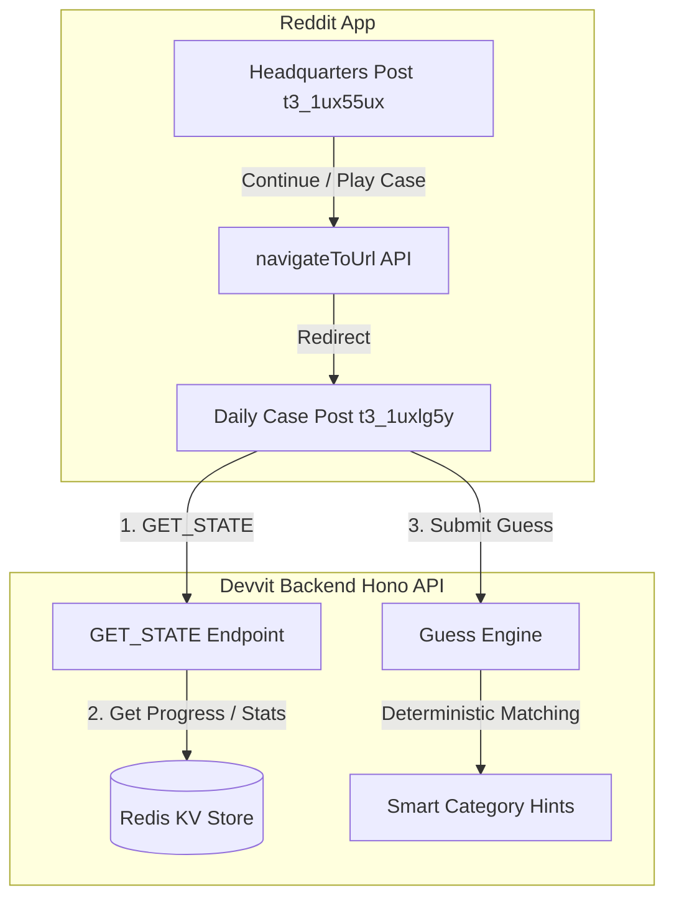

# 🕵️ CrimeGuess

> **Think. Deduce. Solve.** The ultimate interactive daily mystery deduction game built natively on the Reddit Devvit platform.

CrimeGuess brings the thrill of detective work directly to Reddit feeds. Players analyze forensics evidence, follow investigation threads, and use a deterministic semantic hotness deduction engine to crack daily cases and climb the global leaderboards.

---

## 🎮 Core Features

*   **Headquarters (The Launcher):** A central launcher dashboard where users can view their detective profile, browse case archives, check out global rankings, and launch into the daily mysteries.
*   **Decentralized Playable Case Posts:** Rather than embedding everything, every playable case exists as its own independent Reddit post, ensuring lightweight loading, independent thread discussions, and correct Android Native Game Mode execution.
*   **Deterministic Deduction Console:** A semantic guessing engine that evaluates inputs against hidden case answers, returning precise hotness states (🔥 Very Hot, 🌡️ Hot, ♨️ Warm, 🧊 Cold, ❄️ Unknown) and category-smart context hints.
*   **Interactive Forensics Lab:** Unlock crucial scientific evidence (Autopsy reports, Smart-home camera logs, Fingerprints) using Investigation Points (IP) gained through gameplay.
*   **Phaser-powered UI:** High-fidelity interactive graphics rendered smoothly inside Devvit Webview entrypoints.

---

## 🏛️ System Architecture

CrimeGuess uses a clean client-server architecture powered by Devvit's server backend (Node/Hono/Redis) and a lightweight webview client (Vite/React/Phaser).



---

## 🔍 Smart Guess Engine & Hotness Meter

To ensure a fast, self-contained, and highly responsive gameplay experience, CrimeGuess implements an offline guessing algorithm that maps inputs to semantic hotness levels:

| Guess Hotness | Score/Sim | Meaning / Response |
| :--- | :---: | :--- |
| **Correct** | 100% | Unlocks the clue folder card! |
| **🔥 Very Hot** | 95% | "You're almost there." |
| **🌡️ Hot** | 80% | "Very close." |
| **♨️ Warm** | 55% | "You're thinking in the right direction." |
| **🧊 Cold** | 25% | "Related idea, but still far." |
| **❄️ Unknown** | 5% | "No meaningful connection found." |

### Category-Smart Hints
When players guess items from similar motives or professional fields, the engine responds with intelligent semantic suggestions:
*   *Profession detected:* "Wrong profession."
*   *Political connection:* "Think more specific."
*   *Murder delivery:* "Correct murder category. Different delivery method."
*   *Motive family:* "Correct motive family. Think beyond financial gain."

---

## 🗄️ Case Archive

| Date | Case Title | Difficulty | Est. Solve Time | Description |
| :--- | :--- | :---: | :---: | :--- |
| **2026-07-16** | Case #2: "The Last Flight" | ★★★★☆ | 10-15 mins | Autopsy of a flight pilot's mid-air poisoning. |
| **2026-07-15** | Case #1: "The Vault of Silicon Tears" | ★★★☆☆ | 5-10 mins | Sealed room cyber-murder of Marcus Sterling. |

---

## 🛠️ Installation & Playtest Setup

### Prerequisites
*   Node.js v18+
*   Reddit Devvit CLI configured (`npm i -g @devvit/cli`)

### Running Locally
1. Clone the repository:
   ```bash
   git clone https://github.com/hriteshvirat/detective-daily.git
   cd detective-daily
   ```
2. Install dependencies:
   ```bash
   npm install
   ```
3. Start the playtest dev server:
   ```bash
   npm run dev
   ```
4. Access the playtest links outputted by the Devvit terminal in your browser or developer portal.

---

## 📄 License
This project is licensed under the MIT License.
