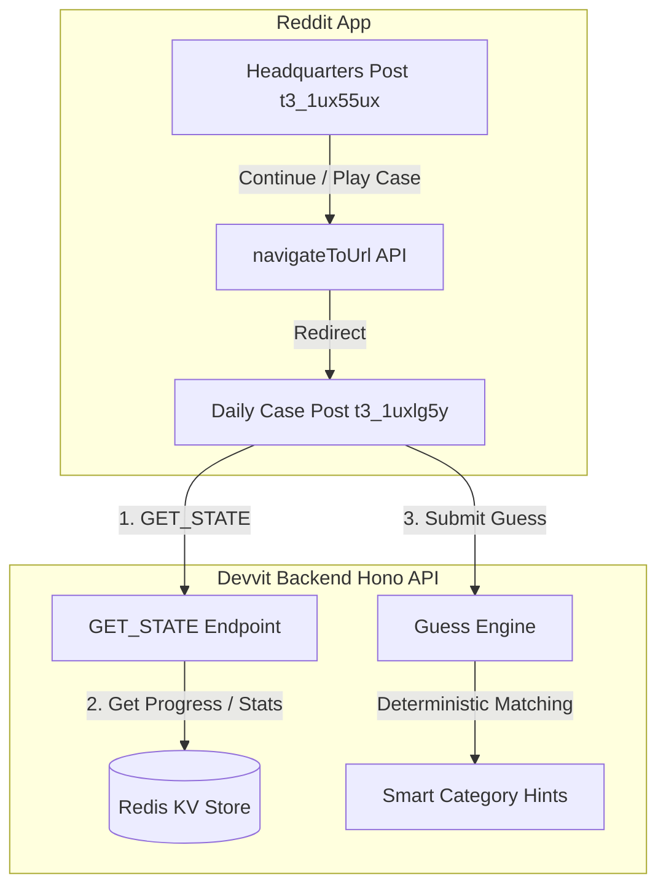
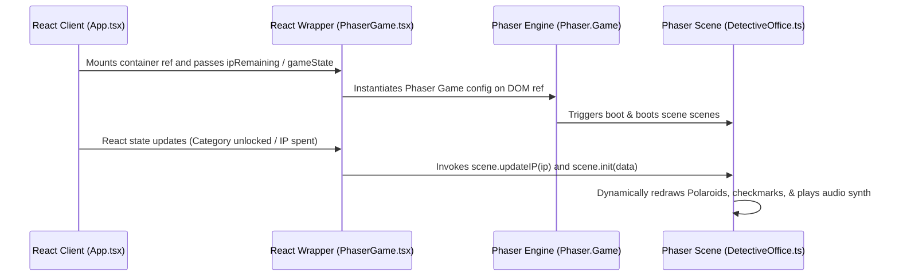

# 🕵️ CrimeGuess

[](https://developers.reddit.com)
[](https://www.typescriptlang.org)
[](https://phaser.io)

CrimeGuess is the ultimate interactive mystery deduction game built natively on the Reddit Devvit platform. Designed specifically for Reddit feeds, it turns static posts into rich, immersive crime scenes where players gather clues, analyze forensics, and solve daily cases. By decoupling the launcher from individual posts, players can discuss plot twists directly in the Reddit comments section, transforming solo puzzle-solving into a collaborative community event.

---

## 🎥 Demo

*   **Video Demo:** [Watch the Gameplay Walkthrough](https://youtu.be/0NxoaS-FgFw?si=l65ie2t2ccl7VHgj)
*   **Live Reddit Experience:** [Play on r/crime_guess_dev](https://www.reddit.com/r/crime_guess_dev/?playtest=crime-guess)
*   **Devpost Submission:** [View our Devpost Portfolio](https://devpost.com/software/crimeguess)

---
## 📖 Walkthrough

New to CrimeGuess or short on time?

If you'd like to quickly see how a complete investigation works, including evidence collection, forensic analysis, deductions, and the final case resolution, you can view the full gameplay walkthrough below.

➡️ **[Case #2: The Last Flight Walkthrough](./walkthrough/README.md)**
---

## 💡 Inspiration

Traditional online detective games are heavily isolated. Players navigate external websites, read mountains of text, or install heavy applications just to solve a single case. We wanted to build a game that lives where communities already gather: Reddit. 

Reddit is the perfect home for detective games. Redditors love parsing details, discussing fan theories, and debating evidence. By delivering bite-sized, daily interactive cases that live inside individual Reddit posts, CrimeGuess creates a collaborative space where the entire comments section becomes a hivemind of detectives working together to crack the case.

---

## 🎯 Features

### 🏢 Headquarters & Progression
*   **Detective Headquarters:** A central dashboard hub that acts as a launcher, profile viewer, and case cabinet directory.
*   **Detective Progression:** Earn ranks based on your success rate, starting as a Novice Sleuth and rising to Chief of Detectives.
*   **Case Archive:** A visual filing cabinet containing previous cases (e.g. Case #1 "The Vault of Silicon Tears") that you can play directly from their original posts.

### 🔍 Playable Case Posts & Gameplay
*   **Independent Interactive Posts:** Every playable case exists as its own independent Reddit post rather than embedding within a single monolithic app container.
*   **Continue Investigation:** Resumes your last active case immediately based on your profile statistics.
*   **Investigation Points (IP):** A resource currency used to unlock new investigation paths and evidence.
*   **Dossier & Forensics Lab:** Interrogate suspects, read autopsy findings, view smart-home power logs, and unlock crime scene data.

### ⚙️ Engine & User Experience
*   **Offline Deterministic Guess Engine:** A local semantic guessing console that parses and scores deductions in milliseconds without relying on slow, costly, or unreliable external AI APIs.
*   **Category-Smart Hints:** Gives semantic feedback (e.g. "Profession detected. Wrong profession") when players are thinking in the right category but have not hit the exact detail.
*   **Cinematic Ending:** Solve the case to unlock animated typewriter summaries, score ticks, and slam down the crimson "CLOSED" stamp with physical canvas particles.

---

## 🕹️ How It Works

CrimeGuess follows a structured, easy-to-learn mystery solving loop:

```
[ Enter Headquarters ]
          │
          ▼
[ Select / Resume Case ] (Redirects to Case Post)
          │
          ▼
[ Read Crime Scene Scenario ]
          │
          ▼
[ Unlock Evidence & Forensics ] (Uses IP)
          │
          ▼
[ Guess Culprit, Motive, Method, or Twist ]
          │
          ▼
[ Receive Thermometer Feedback & Hints ] (Very Hot / Hot / Warm / Cold)
          │
          ▼
[ Unlock Clue Cards & Solve Case ]
          │
          ▼
[ Typewriter Ending & Slam CLOSED Stamp ]
```

---

## 🏛️ System Architecture

CrimeGuess uses a client-server architecture powered by Devvit's server backend (Node/Hono/Redis) and a lightweight webview client (Vite/React/Phaser).



### The Post-Redirection Flow
1. **Headquarters Launcher:** Tapping "Today's Case" triggers Devvit's `navigateToUrl` API.
2. **Reddit Navigation:** The mobile client redirects the user to the specific Reddit post created for that case.
3. **Standalone Cases:** Each case post initializes its own state, updating the player's last played date via Redis KV.
4. **Independent Comments:** Because each case has its own post, players use the native Reddit comment threads to discuss that specific case.

---

## 👾 Phaser Canvas & React Integration

To provide a high-fidelity visual experience, CrimeGuess integrates the **Phaser 3 Game Engine** seamlessly into a **React App context**.

### A. React-to-Phaser Synchronization
The integration uses a unidirectional data-flow wrapper (`PhaserGame.tsx`) that bridges React state variables with the Phaser scene lifecycle.



### B. Phaser Scene Operations
- **`LauncherScene.ts`:** Animates the introductory CrimeGuess cinematic typewriter text, retro CRT flickering scanlines, and triggers the animated dashboard begin button.
- **`DetectiveOffice.ts`:** Renders the interactive detective office desk containing Polaroids representing suspects, motives, methods, and twists. Intercepts card clicks to switch React sidebars, and draws checkmarks when categories are solved.
- **`SolvedScene.ts`:** Animates the end-of-case manila folders and slams a crimson `CLOSED` ink stamp accompanied by sub-bass thud particles and synthesizer audio feedback.

---

## 🛠️ Tech Stack

| Technology | Purpose |
| :--- | :--- |
| **Reddit Devvit SDK** | Custom post types, scheduler tasks, notifications, and key-value database storage. |
| **React** | Renders HUD overlays, console logs, and detective dashboards. |
| **Phaser 3** | Renders interactive canvas desk scenes, card layouts, and canvas animations. |
| **TypeScript** | Strict compile-time typing for both server-side Hono and client-side Phaser/React code. |
| **Hono** | Lightweight server-side router mapping webview API requests. |
| **Vite** | Bundles and builds multi-entrypoint HTML and JavaScript assets. |
| **Web Audio API** | Synthesizes frequency oscillator chiming sounds natively in-browser. |

---

## 🔍 Semantic Guessing & The Hotness Meter

Rather than using heavy, slow, and expensive external LLM APIs that introduce latency, CrimeGuess features a fast offline guessing algorithm. The engine parses user input, sanitizes common stopwords, and evaluates matching weight against target answers and semantic clusters:

*   **Exact Match (100%):** Correct guess! The category unlocks, revealing the clue.
*   **🔥 Very Hot (95%):** "You're almost there."
*   **🌡️ Hot (80%):** "Very close."
*   **♨️ Warm (55%):** "You're thinking in the right direction."
*   **🧊 Cold (25%):** "Related idea, but still far."
*   **❄️ Unknown (5%):** "No meaningful connection found."

### Why we chose this approach:
1. **Instantaneous Feedback:** Guess calculations resolve in milliseconds, preserving the fast-paced flow of the console.
2. **Zero API Failures:** Eliminates network timeouts or server overload issues during peak traffic.
3. **No Hidden Costs:** Completely self-contained and free to run at scale.

---

## ⚡ Challenges

### 📱 Reddit Mobile Compatibility
We noticed that in the official Reddit mobile app, launching the interactive post did not consistently expand the WebView to full screen. We solved this by splitting our bundles: we load a lightweight, static `splash.html` first, and delay the heavy React/Phaser engine loading until `requestExpandedMode('game')` successfully expands the container to full screen.

### 🧭 Redirection & State Persistence
We had to make sure that clicking a case inside the Headquarters launcher post actually closed the launcher and opened the target post. We utilized the native Devvit window redirection postMessage API to orchestrate clean transitions, and synchronized the player's progression states using a structured Redis KV storage system keyed by username.

---

## 🧠 What We Learned

Building on Devvit forced us to think about performance constraints. Storing assets efficiently, keeping webview bundles lightweight, and bridging React states with Phaser taught us how to design highly polished interactive games within sandboxed platform environments.

---

## 🗺️ Future Roadmap

- [ ] **Automatic Daily Case Seeding:** Connect the Devvit scheduler to automatically generate new cases every 24 hours.
- [ ] **Moderator Moderation Panel:** Tools for subreddit moderators to review user submissions and pin approved community cases.
- [ ] **Community Case Editor:** Allow players to design and submit their own custom mysteries directly from the UI.
- [ ] **Better Forensics:** Richer puzzles involving fingerprint dusting, audio transcript parsing, and interactive visual evidence.
- [ ] **Achievements:** Unlock badges for solving cases under 5 minutes or solving 5 cases in a row.

---

## 🚀 Running Locally

### Prerequisites
*   Node.js v18+
*   Reddit Devvit CLI configured (`npm i -g @devvit/cli`)

### Quick Start
1. Clone the repository:
   ```bash
   git clone https://github.com/hriteshvirat/CrimeGuess.git
   cd CrimeGuess
   ```
2. Install dependencies:
   ```bash
   npm install
   ```
3. Start the playtest dev server:
   ```bash
   npm run dev
   ```
4. Copy the playtest link printed in your terminal and load it in your browser.

---

## 📁 Repository Structure

```
├── devvit.json            # Devvit application settings & capabilities
├── src
│   ├── client             # React App overlays and splash templates
│   │   ├── components     # HUD, Console, and Forensics UI components
│   │   ├── phaser         # Phaser game instance configurations and scenes
│   │   ├── App.tsx        # Main application React lifecycle router
│   │   └── splash.ts      # Lightweight inline card splash launcher
│   ├── server             # Server-side API endpoints & Redis KV controllers
│   │   └── main.ts        # Hono endpoints, schedulers, and seeder scripts
│   └── shared             # Shared mystery schemas and typescript types
└── vite.config.ts         # Multi-entrypoint Vite bundler configuration
```

---

## 🏆 Why CrimeGuess is Different

*   **Built Specifically for Reddit:** It embraces the social nature of Reddit, turning post comments into a community case discussion thread.
*   **No Play Friction:** Fast, bite-sized cases that players can solve in under 10 minutes.
*   **Sleek Retro Aesthetics:** Uses glassmorphism styling, retro scanlines, synthesizer audio, and custom Phaser animations.
*   **Fully Serverless & Deterministic:** Low latency, free to run, and highly responsive.
