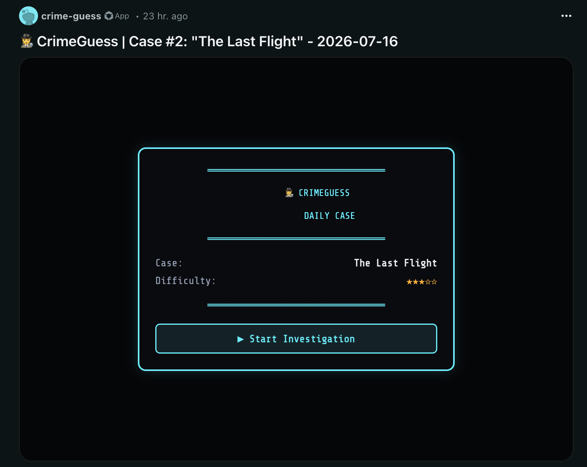
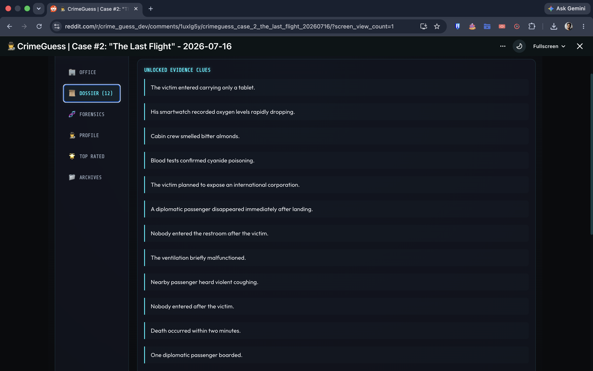
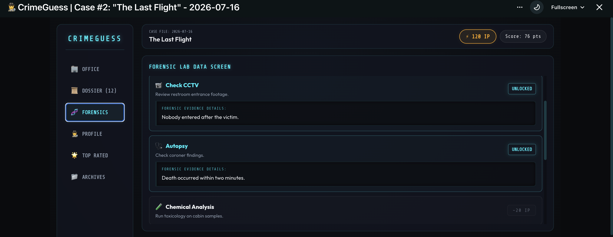
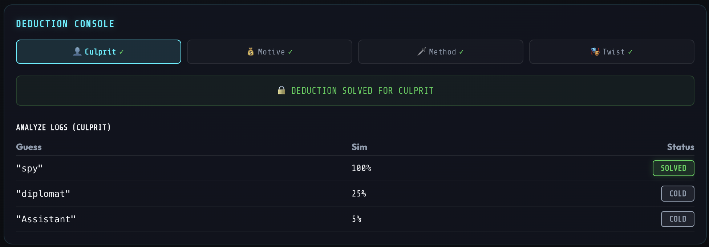
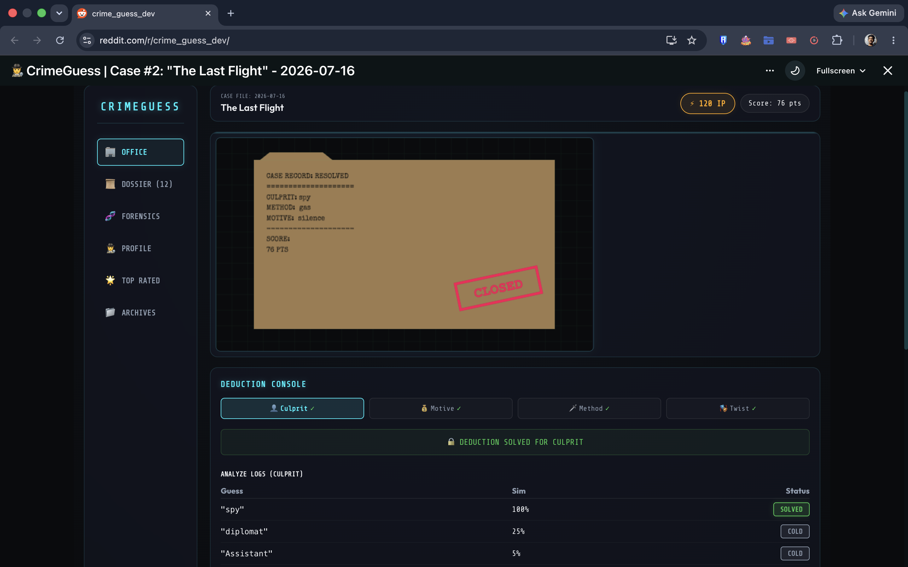
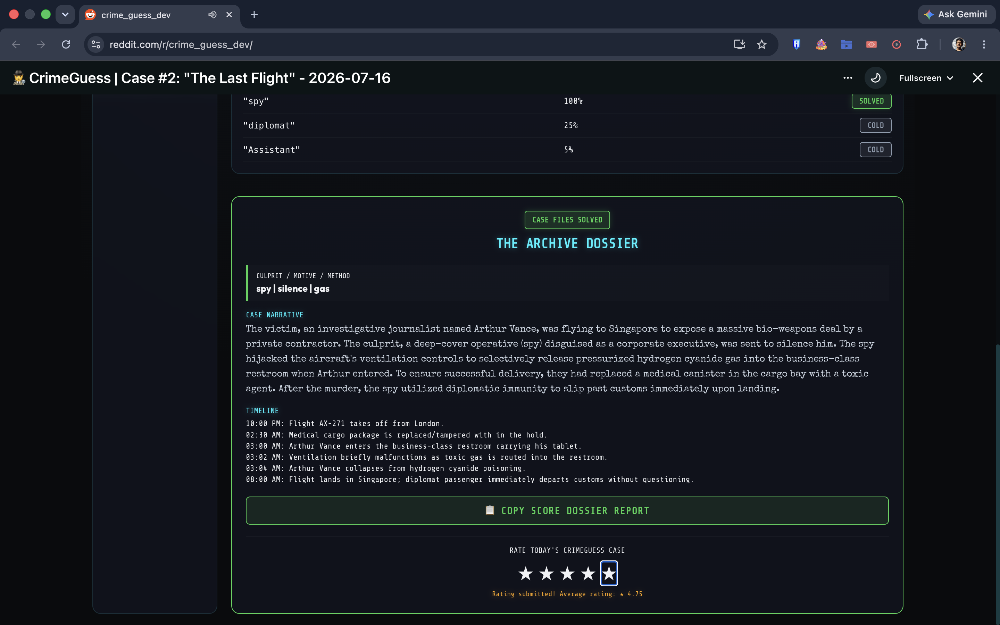

# CrimeGuess - Case #2 Walkthrough

This walkthrough demonstrates the complete investigation flow for **Case #2: The Last Flight**, from entering the case to successfully closing the investigation.

---

## 1. Launch the Investigation

Open **The Last Flight** from Detective Headquarters to begin today's investigation.

---

## 2. Review the Dossier

Read through the collected evidence, witness statements, and case files to build your understanding of the mystery.

---

## 3. Analyze Forensics

Investigate forensic reports including interviews, CCTV footage, autopsy findings, financial records, and laboratory evidence to uncover hidden clues.

---

## 4. Make Your Deductions

Use the Deduction Console to identify the **Culprit**, **Motive**, **Method**, and **Twist**.

CrimeGuess provides similarity feedback such as **Cold**, **Warm**, **Hot**, and **Solved**, helping players progressively narrow down the correct answer instead of relying on brute force.

---

## 5. Case Closed

Once every deduction is correct, the investigation is completed and the case is officially closed.

Players receive a final detective score based on their performance.

---

## 6. Archive Dossier

After solving the mystery, CrimeGuess generates a complete investigation report containing:

- Final deductions
- Complete case narrative
- Timeline of events
- Detective score
- Shareable case report

---

## Gameplay Highlights

- Reddit-native detective experience
- Daily mystery investigations
- Interactive Headquarters
- Evidence collection through Dossier and Forensics
- Similarity-based deduction system
- Detective scoring
- Case archive generation
- Designed for replayable daily investigations
